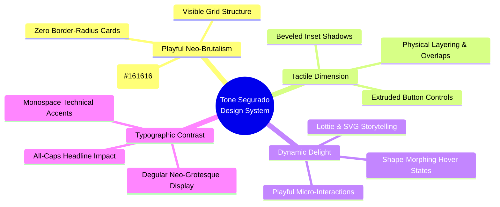

# Tone Segurado — Studio Website Design Guidelines & Design System

This document provides an exhaustive, production-ready Design Guideline and Design System based on the architectural principles, visual language, and interactive patterns of [Tone Segurado's Studio Website](https://www.tonesegurado.com/). 

---

## 1. Executive Summary & Design Philosophy

Tone Segurado’s website is a masterclass in **Playful Neo-Brutalism & Tactile Retro-Pop**. It departs from conventional flat minimalism and sterile corporate web design by combining structural, highly visible grid frameworks with warm, nostalgic color palettes, whimsical character illustrations, and continuous micro-animations.

### Core Design Pillars



1. **Structured Compartmentalization**: Content is never left floating in amorphous whitespace. Every section, service tier, and interactive module is encapsulated within distinct, heavily bordered blocks (`3px solid #161616`). This creates a clear visual hierarchy and modular architecture.
2. **Tactile Dimension (Beveled Pop)**: Instead of relying on generic drop shadows or glassmorphism, interactive elements (especially buttons and badges) use high-contrast **dual inset shadows** (`inset -2px 2px`, `inset 2px -2px`). This mimics physical, extruded 3D push-buttons from retro arcade machines and analog control panels.
3. **Dynamic Delight & Storytelling**: Animation is not an afterthought; it is the primary communication medium. From looping Lottie character illustrations (*God Tone*, *The Thinker*, *Hopping Cheese*) to interactive scroll prompts and mouse-reactive elements, the interface feels alive and responsive.
4. **High-Contrast Typographic Hierarchy**: Pairing expressive, heavy-weight neo-grotesque display fonts (**Degular**) with structured, technical monospace fonts (**Inconsolata**, **Apercu Mono**) establishes an immediate contrast between creative storytelling and technical precision.

---

## 2. Color Palette & Design Tokens

The color system is rooted in warm, earthy neutral backgrounds anchored by pure charcoal borders (`#161616`), punctuated by vibrant retro-pop accents. Never use pure black (`#000000`) for structural borders or body text; always use charcoal (`#161616`) to maintain warmth.

### Root Color Tokens (`:root`)

| Token Name | Hex Code | RGB Sample | Semantic Role & Usage |
| :--- | :---: | :---: | :--- |
| `--161616` | `#161616` | `rgb(22, 22, 22)` | **Primary Structural & Text**: Main borders, headings, body text, dark mode containers. |
| `--gainsboro` | `#E8E6E0` | `rgb(232, 230, 224)` | **Primary Canvas Background**: Warm stone/cream grey used for the overall website canvas. |
| `--floral-white` | `#FCF5EB` | `rgb(252, 245, 235)` | **Card Background**: Soft cream off-white used inside content boxes, service cards, and modals. |
| `--light-salmon-2` | `#F69B66` | `rgb(246, 155, 102)` | **Primary Accent (Warm Peach)**: Hero highlights, step badges, warm CTA buttons, welcome section. |
| `--light-salmon` | `#F7C089` | `rgb(247, 192, 137)` | **Secondary Warm Accent**: Softer peach tone used for secondary badges and gradients. |
| `--brick` | `#DA7438` | `rgb(218, 116, 56)` | **Deep Accent / Shadows**: Terracotta orange used for borders, hover states, and inset shadows. |
| `--light-sky-blue` | `#7AC0FD` | `rgb(122, 192, 253)` | **Cool Accent (Sky Blue)**: Workflow step 2 highlights, secondary interactive buttons. |
| `--dodger-blue` | `#1C8DF0` | `rgb(28, 141, 240)` | **Primary Interactive CTA**: Main Creation Work button background and active link highlights. |
| `--light-steel-blue`| `#B9DEFD` | `rgb(185, 222, 253)` | **Soft Cool Accent**: Inset highlights and subtle background tints. |
| `--emerald-green` | `#24B178` | `rgb(36, 177, 120)` | **Secondary CTA (Animation Work)**: Vibrant mint/emerald green for Tier B service action. |
| `--navajo-white` | `#EBD08C` | `rgb(235, 208, 140)` | **Warm Gold**: Decorative fills, stars, and tertiary background accents. |
| `--khaki` | `#F1CF79` | `rgb(241, 207, 121)` | **Highlight Yellow**: Text markings and badge accents. |

### Custom Scrollbar Tokens
The browser scrollbar is styled as a playful, branded UI component matching the retro tactile theme:
- **Track**: `rgba(0, 0, 0, 0.17)` with `10px` border-radius.
- **Thumb Default**: Coral Pink `rgb(250, 130, 130)` with a `3px solid rgb(22, 22, 22)` border and tactile inset shadow (`rgb(248, 188, 188) 0px 0px, rgb(246, 179, 179) 2px 2px 1px 1px inset`).
- **Thumb Hover**: Warm Gold `rgba(231, 159, 50, 1)` with inset shadow (`2px 2px 1px 1px rgb(224, 187, 32) inset`).
- **Thumb Active**: Crimson Red `rgba(196, 44, 44, 1)` with inset shadow (`2px 2px 2px 1px rgb(221, 58, 58) inset`).

---

## 3. Typography System

The typographic identity relies on tension between expressive organic curves and rigid monospace engineering.

### Font Stack Hierarchy

1. **Primary Display & Headings**: `degular, degular-display, degular-text, sans-serif`
   - *Characteristics*: A variable neo-grotesque typeface with high ink traps, organic curves, and tight character spacing.
   - *Usage*: Hero headlines (`H1`), section titles (`H2`), service package headers, and primary CTA button labels.
2. **Technical & Monospace Accents**: `Inconsolata, "Apercu mono pro", monospace`
   - *Characteristics*: Clean, highly legible monospace and geometric sans.
   - *Usage*: Navigation links, workflow step numbers, category tags, specification lists, and footer metadata.
3. **Experimental Display**: `"Majoranttrial bd", sans-serif`
   - *Usage*: Special artistic statements and experimental showcase titles.

### Typographic Scale & Styling Rules

| Element / Class | Font Family | Size | Weight | Line Height | Letter Spacing | Case / Styling |
| :--- | :--- | :---: | :---: | :---: | :---: | :--- |
| **Hero Title (`H1`)** | Degular Display | `38px` – `55px` | `700` (Bold) | `1.15` (`44px`+) | `-0.5px` | Sentence or Title Case; bold impact. |
| **Section Header (`H2` / `.heading-20`)** | Degular | `29px` – `32px` | `700` (Bold) | `1.12` (`36px`) | `1px` | Uppercase or Capitalized; thick presence. |
| **Subheadings (`H3` / `.heading-24`)** | Degular Text | `24px` – `33px` | `700` (Bold) | `1.15` (`33px`) | `0px` | Title case; used for callouts & challenges. |
| **Card Title (`H4` / `.heading-20`)** | Degular Display | `18px` – `24px` | `700` (Bold) | `1.2` (`24px`) | `0.5px` | Uppercase; used in service packages (Tier A/B). |
| **Body Copy (`P` / `.paragraph-3`)** | Degular Text | `14px` – `16px` | `400`–`500` | `1.4` (`20px`) | `0.5px` | Clean, highly readable sentence case. |
| **Nav Links (`.nav-link-6`)** | Apercu Mono Pro | `11px` – `14px` | `700` (Bold) | `1.0` | `3px` | **ALL CAPS**; letter spacing collapses to `0px` on hover. |
| **Workflow Labels** | Apercu Pro | `13px` | `500` (Med) | `1.3` | `1px` | Title case; technical specifications. |

> [!IMPORTANT]
> **Typographic Rule of Thumb**: Never use browser default sans-serif fonts. Always pair heavy Degular headlines with generous whitespace and bold `#161616` structural borders.

---

## 4. Layout, Grid & Spatial Architecture

The website utilizes CSS Grid (`.w-layout-grid`) and Flexbox to create modular, compartmentalized layouts.

### Structural Breakpoints
- **Desktop (Large Screen)**: `> 991px` — Full multi-column grids, side-by-side service tiers, floating animations.
- **Medium (Tablet Landscape/Portrait)**: `768px – 991px` — Grids compress to 2 columns; navigation collapses to interactive burger menu.
- **Small (Mobile Landscape)**: `480px – 767px` — Single-column stacking (`.w-col-stack`); service tiers display sequentially.
- **Tiny (Mobile Portrait)**: `< 479px` — Fluid width, reduced padding (`15px`–`20px`), font sizes scale down by `15%`–`20%`.

### Section Compartmentalization & Spacing
- **Outer Canvas Padding**: Main container width is capped at `940px` to `1200px` (`.w-container`), centered with automatic horizontal margins.
- **Content Boxes (`.create-tone-god-div-block-14`, `.or-animatediv-block-14`)**:
  - Background: Creamy Floral White (`#FCF5EB`).
  - Border: `3px solid #161616`.
  - Padding: `5%` top/bottom, `10%` left/right.
  - Border-Radius: `0px` (Sharp, uncompromising corners).
- **Grid Gaps**: Standard grid layouts use `16px` to `48px` row gaps and `16px` to `87px` column gaps to ensure breathing room between animated elements.

---

## 5. UI Component Library & Styling Specifications

### 5.1 Interactive Push-Buttons (`.button-3`)
The primary button design is one of the most distinctive features of Tone Segurado's visual identity. It features a tactile beveled appearance that undergoes a **shape-morphing transformation** upon interaction.

```mermaid
stateDiagram-v2
    [*] --> PillState: Default Render
    PillState --> SharpBoxState: Hover (0.5s transition)
    SharpBoxState --> PillState: Mouse Leave
    SharpBoxState --> PressedState: Active / Click
    PressedState --> SharpBoxState: Release
    
    state PillState {
      border_radius: 100px (Pill)
      shadow: Inset Bevel (2px / -2px)
    }
    state SharpBoxState {
      border_radius: 0px (Sharp Rectangle)
      shadow: Inset Bevel (2px / -2px)
    }
    state PressedState {
      border_radius: 16px (Soft Square)
      shadow: Deep Inset Bevel (4px / -4px)
    }
```

#### Exact CSS Implementation for Buttons
```css
/* Core Button Base */
.button-3 {
  z-index: 9999;
  opacity: 1;
  color: var(--white);
  text-align: center;
  letter-spacing: 1px;
  text-shadow: -2px 2px rgba(0, 0, 0, 0.11);
  cursor: pointer;
  background-color: #1680dd;
  border: 3px solid var(--161616);
  border-radius: 100px; /* Default Pill Shape */
  padding: 25px 35px 30px;
  font-family: degular-display, sans-serif;
  font-size: 33px;
  font-weight: 700;
  text-decoration: none;
  transition: border-radius 0.5s ease, box-shadow 0.2s ease, padding 0.2s ease;
  display: inline-flex;
  justify-content: center;
  align-items: center;
  box-shadow: inset -2px 2px #83b7e5, inset 2px -2px #1a588f;
}

/* Hover State: Morph from Pill to Sharp Rectangle! */
.button-3:hover {
  border-radius: 0px; 
  box-shadow: inset -2px 2px #83b7e5, inset 2px -2px #1a588f;
}

/* Active / Pressed State: Soften Corners and Deepen Shadow */
.button-3:active {
  border-radius: 16px;
  box-shadow: inset -4px 4px #13558f, inset 4px -4px #83b7e5, 0 8px 6px -4px rgba(3, 3, 3, 0.11);
}

/* Variant A: Creation Work (Blue) */
.button-3.projectshere {
  background-color: #14a4d8;
  box-shadow: inset -2px 2px #b0d7ee, inset 2px -2px #3b789e;
}

/* Variant B: Animation Work (Emerald Green) */
.button-3.oranimating {
  background-color: var(--emerald-green);
  box-shadow: inset -2px 2px #abf4d7, inset 2px -2px #287956;
}

/* Variant C: Workflow Step Badges (Warm Peach) */
.button-3.absorbeabridgeadvamce {
  color: var(--161616);
  background-color: #f8c785;
  box-shadow: inset -2px 2px #f7dbb6, inset 2px -2px #e4962e;
  padding: 15px 25px;
  font-size: 24px;
}
.button-3.absorbeabridgeadvamce:hover {
  padding-right: 35px; /* Dynamic horizontal expansion */
}
```

### 5.2 Service Package Cards (Tier A & Tier B)
The website presents offerings in side-by-side comparative cards with high visual contrast:
- **Container Structure**: Two equal-width grid columns (`.w-layout-grid.grid-3` and `.grid-4`).
- **Header Badges**: Small circular or square badges `(A)` and `(B)` styled with `.heading-35` in distinct color themes (Warm Salmon vs. Sky Blue).
- **Content Alignment**: Center-aligned Lottie character animation at the top, followed by left-aligned bold uppercase headings (`BESPOKE DELIGHTFUL CONTENT`), descriptive subheadings, and a full-width bottom CTA button.

### 5.3 Navigation Bar (`.navbar-4`)
- **Positioning**: Fixed or sticky top navigation with transparent/mixed-blend-mode background.
- **Brand Logo**: Animated Lottie SVG (`TONE>ANTONIO>tone>antonio.json`) that continuously shifts typography or loops on interaction.
- **Menu Links (`.nav-link-6`)**:
  - Styled in monospace all-caps with `3px` letter-spacing.
  - On hover, letter-spacing compresses to `0px`, font-size increases from `14px` to `18px`, and a custom arrow SVG appears (`SETINHAS-ARROW-19.svg`).
- **Social Media Tray**: Hidden or integrated tray featuring custom hand-drawn retro icons (`facebook`, `instagram`, `discord`, `twitter/X`, `linkedin`, `knownorigin`) that scale up (`1.5x`) and swap background textures on hover.

### 5.4 Client Logo Grid (`.grid-2clients`)
- **Layout**: Dense responsive grid (6 columns on desktop, scaling down to 3 or 2 on mobile).
- **Default State**: Monochrome or subtle vector logos with `opacity: 0.6` and `filter: brightness(200%)`.
- **Hover Interaction**: Opacity transitions to `1.0`, filter resets to full color, and the logo scales up (`transform: scale(1.25)`).
- **Active / Click Interaction**: Playful tilt (`transform: scale(1.3) rotate(-7deg)`).

---

## 6. Motion, Animation & Interaction Principles

Animation is foundational to Tone Segurado's brand identity. All motion must feel **organic, playful, and responsive**.

> [!TIP]
> **Performance Optimization**: Always use SVG or Canvas renderers for Lottie animations (`data-renderer="svg"` or `"canvas"`). Set non-critical decorative animations to `data-loading="lazy"` or trigger them via scroll viewport intersection (`data-autoplay="0"` until in view).

### 6.1 Lottie Animation Taxonomy
1. **Hero & Welcome Loops**: Continuous, smooth cycles that set a welcoming, energetic mood (e.g., *Welcome Tapete*, *Let Your Brand Stand Out* salmon script).
2. **Character Storytelling**: Personified mascots representing workflow states:
   - *God Tone*: Creating from scratch (Tier A).
   - *The Thinker (Pensador)*: Polishing and animating existing visuals (Tier B).
   - *Cookie Monster*: Playful GDPR cookie consent notification.
   - *Little Mouse (Ratinho)*: Animated scroll-down indicator inviting users to explore.
3. **Workflow Metaphors**: Interactive icons representing process phases (*Pacman* consuming dots for "Absorb", *Pintarolas* / paint pills for "Abridge", advancing gears/arrows for "Advance").

### 6.2 Micro-Interactions Summary Table

| Element | Trigger | Animation / Transition | Easing & Duration |
| :--- | :--- | :--- | :--- |
| **Primary Buttons (`.button-3`)** | Hover | `border-radius` morphs from `100px` to `0px`. | `0.5s ease` |
| **Workflow Badges** | Hover | `padding-right` expands from `25px` to `35px`. | `0.2s ease` |
| **Nav Links (`.nav-link-6`)** | Hover | Letter spacing collapses `3px` $\rightarrow$ `0px`; font zooms `14px` $\rightarrow$ `18px`. | `0.3s ease` |
| **Client Logos (`.image-2`)** | Hover | `opacity: 0.6` $\rightarrow$ `1.0`; `scale(1.0)` $\rightarrow$ `scale(1.25)`. | `0.25s ease-out` |
| **Client Logos (`.image-2`)** | Click | `scale(1.3)` with playful tilt `rotate(-7deg)`. | `0.1s ease-in` |
| **Profile / Art Thumbnails** | Hover | Frame border morphs `border-radius: 25px` $\rightarrow$ `120px`. | `0.4s cubic-bezier` |

---

## 7. Implementation Checklist & Best Practices

When developing new pages, components, or web applications adhering to Tone Segurado's design guidelines, follow this verification workflow:

- [ ] **Structural Borders**: Ensure all primary containers, cards, and buttons have a solid `3px solid #161616` border. Do not use borderless floating cards.
- [ ] **Color Accuracy**: Verify that backgrounds use `--gainsboro` (`#E8E6E0`) or `--floral-white` (`#FCF5EB`). Do not use pure `#FFFFFF` as a page background or `#000000` for borders/text.
- [ ] **Tactile Shadows**: Apply dual inset box-shadows (`inset -2px 2px`, `inset 2px -2px`) to all clickable buttons and badges to maintain the extruded retro-pop aesthetic.
- [ ] **Button Morphing**: Confirm that `.button-3` elements successfully transition from pill (`100px`) to sharp rectangle (`0px`) on hover.
- [ ] **Typographic Pairing**: Check that main section headings use bold neo-grotesque display typography (**Degular**), while technical labels, navigation, and step numbers use clean monospace (**Inconsolata** or **Apercu Mono**).
- [ ] **Lottie & SVG Integration**: Ensure every core section includes at least one engaging, lightweight Lottie or SVG micro-animation to maintain visual vibrancy and storytelling.
- [ ] **Responsive Grid Gaps**: Maintain generous spacing (`16px`–`87px` grid gaps) on desktop, gracefully stacking into single-column layouts on mobile `<767px`.
